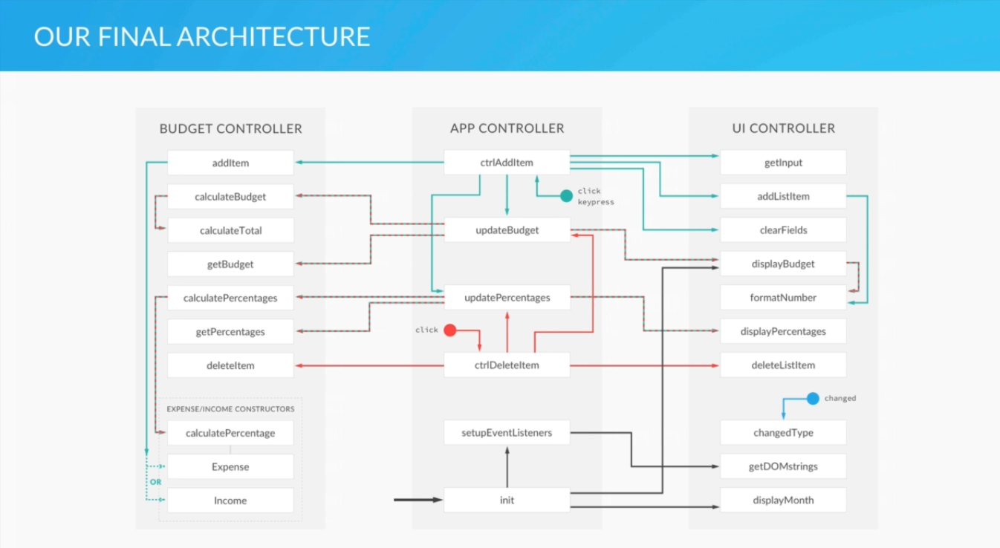

# Budget_App_JS

## To-Do List Before Coding

### 1. Planning 
### 2. Design
### 3. Coding

## Planning

### 1. add event handeler
### 2. Get Input/Output Values
### 3. New Item to Data Structures
### 4. Add new item to UI
### 5. Calculate Budget
### 6. Update the UI

## Modules
### 1. UI Modules
### 2. Data Modules

## UI Modules
### Get Input Values
### Add the new item to the UI
### Update the UI

## Data Modules
### Add the item to our data structure
### Calculate Budget

## Controller Module
### Add event controller

# Final Architecture

